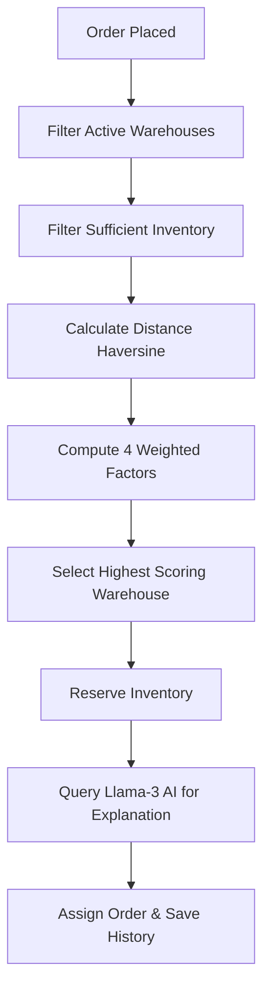

# 🚚 Order Routing Engine — AI-Powered Warehouse Selection

A full-stack logistics decision platform inspired by Amazon, Flipkart, and Blinkit. Place a customer order and the system instantly selects the optimal warehouse based on distance, inventory, delivery time, and cost — with an AI-generated business explanation.

## 📂 Project Structure

```bash
/
├── client/          # React.js Frontend (Vite)
│   ├── src/    
│   │   ├── api/
│   │   ├── components/
│   │   ├── context/
│   │   └── pages/
└── server/          # Node.js + Express Backend
    ├── controllers/
    ├── models/
    ├── routes/
    ├── services/
    ├── server.js
    └── seed.js
```

## 🚀 Quick Start

### 1. Frontend
```bash
cd client
npm install
npm run dev
```

### 2. Backend
```bash
cd server
npm install
node server.js
```

### 3. Seed Database
```bash
cd server
node seed.js
```

## ⚙️ How the Routing Engine Works



## 🧮 Weighted Scoring Formula

| Factor | Weight | Formula | Description |
|--------|--------|---------|-------------|
| **Distance** | 35% | `1 / (1 + distance_km)` | Haversine distance in kilometers |
| **Inventory** | 35% | `availableQty / (availableQty + reservedQty)` | Total stock ratio availability |
| **Delivery** | 20% | `1 / ceil(distance_km / 200)` | Assumes 200km travel per day |
| **Cost** | 10% | `1 / (1 + distance_km * 5)` | Cost factor at ₹5 per km |

## 🔑 Environment Variables

Create a `.env` file in the `server/` directory:

```env
PORT=5000
MONGODB_URI=mongodb+srv://<username>:<password>@cluster.mongodb.net/order_routing
GROQ_API_KEY=gsk_your_groq_api_key_here
```

## 🔌 API Endpoints

| Method | Endpoint | Description |
|--------|----------|-------------|
| **POST** | `/api/route-order` | Process new order and run routing engine |
| **GET** | `/api/routing-history` | Fetch log of AI routing explanations |
| **GET/POST/PUT** | `/api/warehouses` | Manage warehouses |
| **GET/POST** | `/api/products` | Manage products |
| **GET/PUT** | `/api/inventory` | Manage inventory logic |
| **GET/POST/PUT** | `/api/orders` | Manage customer orders |

## 🛠️ Tech Stack

| Domain | Technology | Use Case |
|--------|------------|----------|
| **Frontend** | React, Vite, Material UI | Dark glassmorphism UI |
| **Backend** | Node.js, Express.js | API routing & controllers |
| **Database** | MongoDB, Mongoose | Schema definitions & persistence |
| **Map** | Leaflet, React-Leaflet | Visualizing routes and nodes |
| **AI** | Groq SDK (Llama 3.1) | Natural language business logic |

## 👥 User Roles

| Role | Credentials | Access |
|------|-------------|--------|
| **Admin** | `admin` / `admin123` | Full access (Add Warehouses, Route Orders, Dashboard) |
| **Manager** | `manager` / `manager123` | Inventory updates, mark orders Fulfilled |

## ✨ Key Features

- **Deterministic Routing**: Complex weighted calculations to prevent out-of-stock assignments.
- **AI Explanations**: Groq and Llama 3.1 provide business-friendly context to system decisions.
- **Interactive Mapping**: Leaflet visually draws polylines from customers to fulfillment centers.
- **Real-Time Inventory**: Automated reservation of quantities the exact second an order is routed.
- **Premium UI**: Seamless Material UI dark theme with glassmorphism alerts and data grids.
